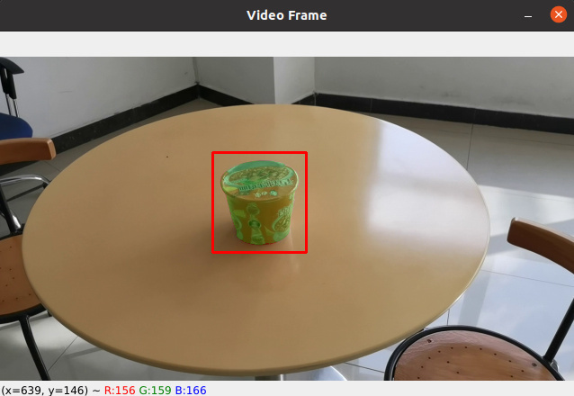

# Flow_Track
Using optical flow and segment anything model to track any object.

## Usage

1. install numpy, pytorch, opencv and SAM
2. put needed models (RAFT and SAM) in the `models` folder
3. change the model and video path in `flow_track.py`
4. run `python flow_track.py`

The code are mainly borrowed from [RAFT](https://github.com/princeton-vl/RAFT).

